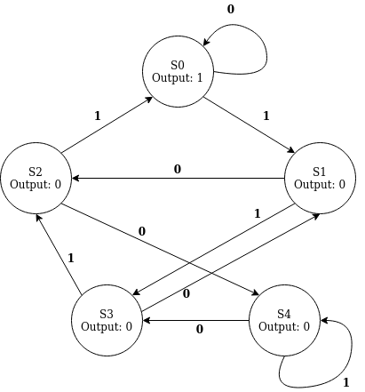

# Digital Design Lab 2

## Contents
1. [Before you start](#before-you-start)
2. [Hand-Synthesis of One-hot decoder](#hand-synthesis)
3. [Divisible-by-5 FSM](#divisible-by-5-fsm)

## Before you start

### Optional: NAND Game
[NAND Game](https://www.nandgame.com/) is a pretty good browser-based logic-gate game that walks you through the layers of abstraction going from NAND gates to a functional (albeit simplistic) microprocessor. This isn't required, but it is a fun way to see how things are built up from gates.

### Important terminology
- Serial Data: Data that is sent 1 (or a few) bits at a time, instead of being presented all at once in parallel. 
- Most/Least-significant-bit first: Direction of a serial data stream. MSB sends bits from highest to lowest place-value, LSB is the opposite.

## Hand-Synthesis
As a refresher, the process of converting a higher-level description into a circuit *netlist*, or gate-level representation, is called *synthesis*. As a first exercise, try synthesizing the following SystemVerilog description into gates by hand. You can use any of the basic gates (AND, OR, NOT, NAND, NOR) with any number of inputs (e.g. 3-input AND) in addition to 2-input XOR and XNOR, 2:1 muxes, N-bit full adders, and D Flip-Flops with active-low reset. Draw a diagram (by hand if you want).


```sv
module decoder(
    input clk,
    input n_rst,
    input [1:0] address,
    output logic [3:0] select
);

    logic [1:0] addr_ff; // address flip-flops

    always_ff @(posedge clk, negedge n_rst) begin
        if(!n_rst) begin
            addr_ff <= 0;
        end else begin
            addr_ff <= address;
        end
    end

    assign select = (4'b1 << addr_ff);

endmodule
```
This module describes a small decoder, where the address is stored in D Flip-Flops. The output is a one-hot encoding of the input, i.e. for address N, the Nth bit of output is set to 1. This is summarized in the following table (numbers are binary).

| address | select |
|:-------:|:------:|
|   00    |  0001  |
|   01    |  0010  |
|   10    |  0100  |
|   11    |  1000  |


**Task**: Draw a gate-level circuit that would implement this. 

## Divisible-by-5 FSM
Divisibility of a binary number, sent as an MSB-first serial data stream, can be easily recognized by a Finite State Machine. For this part of the lab, you will implement an FSM that detects if a number is divisible by 5, as specified in the image below:



**Question**: Why does this work? As a hint, consider the states to be the "current value" (e.g the number that has been "shifted in") modulo 5.

In the file `./src/fsm.sv`, you will need to fill in the code that implements the FSM specified in the above figure. Next, look at the code in `./tb/tb_fsm.sv`. This TB is more involved than those in Lab 1, and will require filling in more of the code. At a high level, the TB uses two core tasks for testing: `send_bit`, and `send_stream`. `send_bit` sends a single bit of your input to the FSM, while `send_stream` *uses* `send_bit` many times to send a larger stream of data to the FSM. The testbench uses the `TestVector` struct to organize the data and bundle it with metadata such as the expected FSM output.

**Task**: Implement the divisible-by-5 state machine, and fill in the missing parts of the TB. Ensure that all tests pass.

**Question**: What would you need to add to this FSM to allow it to restart without pulsing the asynchronous reset?
> Note: Asynchronous resets usually pertain to many modules, and are usually used only after the device powers on, so using the asynchronous reset is not usually possible during runtime.

