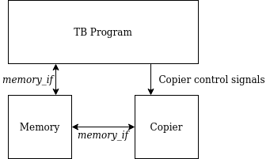

# Digital Design Lab 3

## Contents
1. [Before you start](#before-you-start)
2. [Evaluating PPA](#evaluating-ppa)
2. [Memory Copier](#memory-copier)

## Before you start

### Stacks
A stack is an abstract data structure that implements a last-in, first-out queue. As the name suggests, you can understand a stack as objects being stacked on top of one another. For instance, plates in a restaurant: you place clean plates on top of the stack, and take plates from the top of the stack to serve food.

A stack has 2 major operations: `push(A)`, which will *push* an item on top of the stack, and `pop()` which will take an item off the stop of the stack and return it. Additionally, stacks may offer the ability to *peek* at an object on the stack: see the value of it without popping the item off the stack.

### Evaluating Mathematical Expressions with a Stacks and an FSM
We can parse mathematical expressions such as $(1 + 2) * 3 / 4$ using a finite state machine controlling a stack. The input will arrive one symbol at a time, from left-to-right, and we will output [Reverse Polish Notation](): `2 1 + 3 * 4 /`. Ordering the operations like this will allow them to be easily evaluated. To evaluate an RPN expression, we can simply move left-to-right and aply the following two rules:
1. When we get a number, push it on to a stack
2. When we get an *operator*, pop the top values off the stack, apply the operation, and push the result onto the stack again

The following table walks through the above example. The 'Stack Result' shows the state of the stack after the action is taken. The top of the stack is to the right (and bolded).

| Input Symbol | Action | Stack Result |
|:------------:|:-------|-------------:|
| 2 | PUSH 2 | **2** |
| 1 | PUSH 1 | 2 **1** |
| + | A = POP; B = POP; PUSH A + B | **3** |
| 3 | PUSH 3 | 3 **3** |
| * | A = POP; B = POP; PUSH A * B | **9** |
| 4 | PUSH 4 | 9 **4** |
| / | A = POP; B = POP; PUSH A / B | 

## Evaluating PPA
In this part of the lab, you will evaluate (static) power, performance, and area using the OpenSTA tool. 

### FIXME: Lab ideas
1. Do some kind of pipelined computation. No hazards/control.
2. Maybe parameterize pipeline depth, and see the power/performance/area of different configurations?
3. 

## Memory Copier
This lab will have you practice hierarchical design by integrating together a few submodules to create a larger module.

### Memory Copier Specification
The "Memory Copier"'s job is to read consecutive data from one location in a memory, and write it consecutively to another location. This is also known as Direct Memory Access (DMA), which is a critical piece of hardware in many computer systems that is responsible for performing certain bulk copy operations so that the CPU can spend its cycles performing useful work. The Memory Copier is not a full DMA implementation (hence the name not being DMA controller), but works in much the same way.

The port list is as follows:
- `memif` - a `memory_if` instance connecting the copier to the memory
- `src_addr` - the address to *read* data from
- `dst_addr` - the address to *write* data to
- `copy_size` - how many bytes to copy
- `start` - asserted when the copier should start copying
- `finished` - asserted **by** the copier when copying is complete

You may assume that:
- Once `start` has been asserted, the other input signals will not change until you assert `finished`
- You copy addresses in order: src, src + 1, src + 2, ... src + copy_size
- You do not need to check for any errors. For example, if the `src_addr` and `dst_addr` overlap or are the same, or if the copy_size would cause a rollover, you may ignore these conditions and just perform the copy.
- There is at least one cycle after asserting `finished` where `start` will not be asserted

### Provided Submodules
#### memory_if
This module has 2 modports: `request` and `response`. The `request` modport will be used by the Memory Copier and TB to send requests (read or write) to the memory. The `response` modport is used by the memory in responding to requests. The signals are as follows:
- `wen` - write enable. Current request is a write.
- `ren` - read enable. Current request is a read.
- `addr` - the address of the request
- `rdata` - the value read from the memory
- `wdata` - the value to write into the memory (from the copier or TB)
- `ready` - indicates that the data is valid and the operation is complete. If `ready` isn't high, the requester should not assume that `rdata` is correct or that the memory has actually performed a write.

#### memory
This is a simple dual-ported memory. One port will be used for the Memory Copier to access, the other will be for the TB to access to perform checks. This is not a component of Memory Copier, it is testing IP, so you should not instantiate this module in your Memory Copier.

#### data_register
This is a simple 8-bit register that serves as temporary storage. If the `WEN` signal is asserted at the rising edge of a clock, the `wdata` value will be stored in the register. The output `data` is the data currently stored in the register. Resets to 0.

#### flex_counter
This is a parameterizable counter module. The parameter `NUM_CNT_BITS` can be selected to create an N-bit counter. The `clear` signal is a *synchronous* reset, that is, asserting `clear` will cause the counter value to reset to 0 at the rising edge of the clock. `rollover_value` sets the maximum counter value: when this value is reached, the counter will automatically roll over to 0, and the `rollover_flag` will be set to 1 for a single cycle. `count_enable` is used to control when the counter will actually increment: holding `count_enable` at 0 will make the counter stop, setting it to 1 will allow it to count. Finally, `count` is the current value of the counter.

### Getting Started
Since this is a larger module, here are some design hints:
1. Use an FSM to control the system. You might have states like IDLE, READ, WRITE, and FINISH. Draw an FSM diagram to help your design, listing which signals should be asserted to what values.
2. Consider how the pieces provided fit into the design. Where would you use a counter, or a data register? Draw an RTL diagram.
3. Fill in the TB BEFORE writing the code for the copier. This should help with incremental testing, and help you understand the design requirements.

The TB for this assignment consists of 3 parts: the TB driver code, the DUT, and the memory module. You can think of them being connected like this:

**Task**: Implement the Memory Copier by:
1. Draw an RTL diagram showing the blocks and connections
2. (optional, but helpful): Draw a waveform diagram (using [Wavedrom](https://wavedrom.com/)) to show a transaction
3. Fill in the TB test cases
4. Write the code for the module
