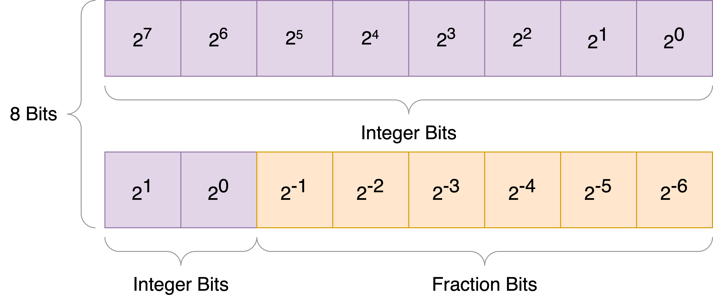

# Intro to SoCET: Systems I Lab

## Before you start

This lab is primarily a software lab, specifically about writing C and RISC-V
assembly code. This document assumes some familiarity with C, but none with
RISC-V. We will introduce many of the instructions that you will use. However,
the definitive instruction listing can be found at the [RISC-V
Website](https://riscv.org/technical/specifications/). You should also be
comfortable with the binary representation of numbers.

This document is written in Markdown and is best seen rendered! Please view
this through the GitHub web interface or an offline Markdown renderer.

This lab will require you to simulate the AFT-dev system-on-a-chip (SoC) using
Verilator and GTKWave. Please review the digital design labs if you are unsure
about Verilator, GTKWave, or Makefiles.

In this lab, you will be working with image processing code (THE IMAGE
PROCESSING CODE IS PROVIDED). For a basic overview of image processing, please
read the [document about the Fourier Transform](docs/ft.md) for a conceptual
grounding on what you'll be doing in this lab.

### Basics of RISC-V
RISC-V is an open standard for an instruction set architecture (ISA). RISC-V
has 32 general-purpose registers, and register 0 (x0, zero) is hard-wired to 0.
The registers can be referred to as xN, for the Nth register, or by their [ABI
Names](https://riscv.org/wp-content/uploads/2015/01/riscv-calling.pdf). For
these examples, we will use the ABI names, since they are more descriptive and
easier to read.

> Note: An Application Binary Interface (ABI) describes a protocol, or
> contract, for how code should inter-operate. Things like the calling
> convention (where data is located when you call a function, where return
> values should live, whose responsibility it is to save register values),
> sizes of different types (how many bits is an `int`? Depends on which
> computer you're using!), alignment requirements (e.g. an alignment of 4 means
> that the address is a multiple of 4), and more. You don't need to be familiar
> with any particular ABI details for this lab, but the word will come up when
> doing this kind of programming!

**Definitions**:
1. Caller: The piece of code that calls a function
2. Callee: The function that was called
3. Caller-saved: Registers whose values are not guaranteed to be preserved across function calls. That is, if you call a function, caller-saved registers may be modified by the callee. If the caller requires those values to be saved, it must store them into memory somewhere (typically on the stack) before calling the function, and load them back into the registers after the function returns.
4. Callee-saved: Registers whose values *must* be preserved accross function calls. This means that if the callee wants to make use of these registers, they must save their value (typically on the stack) before using them, and restore their value before returning.

A quick summary of ABI register names:
- zero (x0): hard-wired zero
- ra (x1): return address (e.g. for function calls)
- sp (x2): stack pointer (callstack)
- gp (x3): global pointer, used for accessing global variables in compiled code from higher-level languages
- tp (x4): thread pointer, pointer to thread-local data
- t0-t6 (x5-x7, x28-x31): temporary registers, caller-saved
- s0-s11 (x8-x9, x18-x27): saved registers, callee-saved. x8 is also the (optional) frame pointer.
- a0-a7: argument registers. Hold arguments for function calls. a0 and a1 also serve to hold return values from a function.

For the full details, see the [RISC-V UABI
Documents](https://github.com/riscv-non-isa/riscv-elf-psabi-doc/blob/master/riscv-abi.adoc),
specifically the "calling convention" document.

### Interrupts and Exceptions
An interrupt is a hardware-initiated transfer of control that is usually
*asychronous*; that is, it can happen at any time, and the currently-executing
application has no knowledge of when an interrupt will occur. When an interrupt
occurs, the CPU will jump to a pre-defined address (an *interrupt vector*),
save the PC of the location where it was when the interrupt happened (i.e.
where to return to after the interrupt handler is done) based on the condition
that caused it, and begin executing code here (the *interrupt handler*). 

Interrupts can be caused by various hardware peripherals, and in some
architectures (RISC-V included) by a CPU directly. For example, things like:
- A hardware timer running out
- A CPU core interrupting another CPU core
- An external peripheral (e.g. USB) completing an action

In RISC-V, interrupt handling is split between the CPU and the *interrupt
controller*, a dedicated piece of hardware that manages interrupts and notifies
the CPU of interrupt conditions.

> Note: An *exception* is similar to an interrupt, only it is *synchronous*
> with the executing application. An exception is typically due to an error
> condition with the running program, such as a program attempting to access
> a bad memory location (segfault), executing an illegal instruction, a page
> fault, or even a *syscall*. Exceptions are handled in the same way as
> interrupts in RISC-V and many other ISAs.

On the CPU side, there are a number of *Control & Status Registers* (CSRs) that
govern interrupt handling. Here is a subset of these registers:
- `mtvec`: Holds the base address of the interrupt *vector table*
- `mstatus.mie`: Holds control bits for many CPU functions. The `mie` bit determines whether interrupts are enabled/disabled globally.
- `mie`: Has a bit per interrupt source, that determines whether the specific interrupt is enabled or not. This is useful for filtering out sources of interrupts that you are not interested in. 
- `mip`: A bit per interrupt source, indicates that an interrupt is *pending*, e.g. the condition has occurred but has not been acknowledged
- `mepc`: The address you were executing at before the interrupt happened. This is where the CPU will return to when you exit the interrupt handler
- `mcause`: A unique value that tells you what caused the interrupt

To set up interrupts on a RISC-V CPU, you must set up `mtvec`, `mie`, and
`mstatus.mie`. We won't go over the exact process in detail, but if you're
interested, take a look at the code in `sw-tests/support`, which sets up
interrupts.
> Note: Exceptions are always active (they do not require an enable bit). This
> is because most exceptions indicate an error condition that must be dealt
> with, such as an attempt to access a protected memory range, or executing an
> illegal instruction.

### RISC-V privilege basics 

The '`m`' prefix on these registers indicates the *privilege level* of the CPU.
Machine ("M")-mode is the highest privilege, where firmware like a BIOS would
run, and gives full access to the hardware. RISC-V also supports 2 more basic
modes: Supervisor ("S") mode has less privilege than M-Mode, and is typically
where a desktop OS kernel would run. S-mode comes with its own set of CSRs,
most notably CSRs that control *virtual memory*. User "U"-mode is where
applications can run and has the least privilege.

The privilege mode controls what instructions can be run by the executing code,
which CSRs can be accessed, and even which memory regions can be accessed. For
example, an application running in U-mode cannot alter the `mtvec` register to
redirect interrupts to a new location: only M-mode software can do this,
providing a level of security from malicious (or poorly-written) applications.

The privilege mode can be escalated using the `ecall` instruction, which causes
a *synchronous* exception that goes to the next-highest mode. Symmetrically,
each privilege mode (besides "U") has a special instruction `xret`, where `x`
is the current mode (e.g. `mret` for M-mode) that lowers the privilege back to
what it was before the last interrupt/exception and resumes the application at
the address in the corresponding `xepc` register.
> It might seem strange that an instruction can escalate privilege mode; after
> all, if you can just upgrade your privilege, what is being protected?
>
> However, because `ecall` causes an *exception*, program control is
> transferred to an exception handler owned by software running in the
> next-higher privilege mode (e.g. OS, hypervisor, firmware); that is, the
> attacker can escalate the privilege mdoe, but cannot choose which code runs,
> and therefore cannot access any protected resource without permission from
> the OS.

For example, consider an application running in U-mode, and an OS running in
S-mode. If the application requires access to a particular resource (e.g. more
memory), it must use a *syscall*, which would be implemented by loading some
arguments into the registers, then using `ecall` to enter the OS in S-mode.
After doing the requested work, the OS will use the `sret` instruction to
resume the application in U-mode.

### Fixed Point

[//]: # (TODO: talk about need for decimal representations of things, floating point is too complex for many embedded systems)
Part of the art of microcontroller programming is that your target is nowhere
as powerful of any modern consumer hardware. In fact, it's often not as
powerful as decades-old hardware. One piece of hardware which is commonly left
off microcontrollers due to area reasons is a floating point unit (FPU).
Floating point representation is capable of representing a very large range of
decimal values however, it is a very computationally expensive representation.
As an example, let's look at the [Intel 8087 FPU
coprocessor](https://en.wikipedia.org/wiki/Intel_8087). With a 5Mhz clock,
a single floating point add could take up to 100 clock cycles while things like
exponentiation could take up to 500 cycles
([source](https://www.pcjs.org/documents/manuals/intel/8087/)). Keep in mind
that integer addition is a single cycle operation even on the weakest of
microcontrollers. Most of the time, we don't need all the precision that
floating point provides when working in embedded systems. Instead, we can use
a less precise, but more computationally efficient representation called fixed
point.

The fixed point representation **fixes** the decimal point somewhere in
a bitvector. Given a 8-bit integer, you could have multiple fixed point
representations with varying precision. For example, you could have 4 integer
bits and 4 fraction bits, you could have 6 integer bits and 2 fraction bits,
or more generally, you could have M integer and N fraction bits where M+N is
equal to 8. We can call these representations Q4.4, Q2.6, and Q**M**.**N**.
When we have 4 fraction bits, our maximum precision is 0.0625, while if we
have 6 fraction bits, our maximum precision is 0.015625. The image below shows
the bit values of a Q2.6 representation of an 8 bit integer (bottom) in
comparison to the bit values of a regular 8 bit integer (top).



Fixed point is a nice decimal representation for embedded systems because it is
computationally simple. Let's take a look at how fixed point addition of a Q2.2
number could work.

---
**NOTE**

As a convention, we will represent fixed point binary values with a decimal
point separating the integer and fraction parts. We will also explicitly show
conversion between decimal and binary formats although this is not actually
done in hardware.

---

Let's start off with calculating 0.5 + 0.5. We can see that regular binary
addition works normally using this representation! This means that we can just
use our single cycle addition instructions instead of having to support
expensive 100 cycle floating point instructions in hardware.

```
0.5 + 0.5         | Original calculation
0b00.10 + 0b00.10 | Conversion to fixed point
0b01.00           | Binary addition
1                 | Conversion to decimal
```

Let's take a look at how integer overflow would work. Let's try calculating
3.25 + 0.75. Once again, we use normal binary addition to find the sum of these
two terms. As expected, this overflows to 0 since the maximum integer value we
can represent is 3.

```
3.25 + 0.75       | Original calculation
0b11.01 + 0b00.11 | Conversion to fixed point
0b00.00           | Binary addition
0                 | Conversion to decimal
```

Let's see if the two's complement representation of signed values can be
extended to fixed point. Let's try calculating 0.5 + (-0.5).

```
0.5 + (-0.5)         | Original calculation
0b00.10 + (-0b00.10) | Conversion to fixed point
0b00.10 + 0b11.10    | Two's complement conversion
0b00.00              | Binary addition
0                    | Conversion to decimal
```

Now let's see how we can multiply fixed point numbers. Let's start off with 1.5 * 2.5.
There are three peculiarities in this routine. The first peculiarity is that we
double the amount of bits we use in order to perform the multiplication in step
2. Generally, binary multiplication of two N bit integers will result in a 2N
bit integer (try to think about why this is, hint: what is the maximum value of
an N bit integer and what happens if you multiply that by itself?). The second
peculiarity is that we right shift by the number of fraction bits in step 4.
Since our fixed point representation represents the bit pattern $x$ as
$\frac{x}{2^2}$, if we perform $\frac{x}{2^2}*\frac{y}{2^2}$, we get
$\frac{xy}{2^2}\frac{1}{2^2}$. To adjust for this extra $\frac{1}{2^2}$, we can
right shift (which can perform division by a exponent of 2). The final
peculiarity is that we right shift by the number of fraction bits - 1, take the
lower bit, and add it to the previous shift. This step performs some rounding
correction by compensating for the last bit we shifted out.

```
0 | 1.5 * 2.25                | Original calculation
1 | 0b01.10 * 0b10.01         | Conversion to fixed point
2 | 0b000001.10 * 0b000010.01 | Extension to Q6.2
3 | 0b001101.10               | Binary multiplication
4 | 0b000011.01               | Right shift by number of fraction bits
5 | 0b000110.11               | Right shift by number of fraction bits - 1
6 | 0b000000.01               | Bitwise & 0x1
7 | 0b000011.10               | Rounding correction adding 4 and 6
8 | 0b11.01                   | Truncating to original size
9 | 3.25                      | Conversion to decimal
```

Let's double check that this still works for signed values. Let's multiply 1.25 * (-0.5).
There are two important points to ensure this works correctly.  The first point
is that we must sign extend the values in step 3. Sign extension copies the most
sigificant bit into each of the extended bits. For example, 0b10 sign extended
to 4 bits becomes 0b1110 while 0b01 sign extended would be 0b0001. The second
point is that we must use **arithmetic** right shifting in step 5. Arithmetic
right shift copies the most significant bit into each of the new bits shifted
in. For example, 0b10 arithmetic right shifted by 1 would be 0b11 while 0b01
arithmetic right shifted by 1 would result in 0b00.


```
0  | 1.25 * (-0.5)             | Original calculation
1  | 0b01.01 * (-0b00.10)      | Conversion to fixed point
2  | 0b01.01 * 0b11.10         | Two's complement conversion
3  | 0b000001.01 * 0b111111.10 | Sign extension to Q6.2
4  | 0b111101.10               | Binary multiplication
5  | 0b111111.01               | Arithmetic right shift by number of fraction bits
6  | 0b111110.11               | Arithmetic right shift by number of fraction bits - 1
7  | 0b000000.01               | Bitwise & 0x1
8  | 0b111111.10               | Rounding correction adding 5 and 7
9  | 0b11.10                   | Truncating to original size
10 | -0.5                      | Conversion to decimal
```

# Lab Tasks

### 1. Set up AFT-dev

To get started, clone the AFT-dev repository and follow its build instructions.
If your account is set up properly, this should be as simple as:

1. Set up the Python virtual environment according to the README.md
2. Run `setup.sh` to download the needed libraries and submodules
3. Run `build.sh` to build the Verilator simulation
4. Run `./aft_out/sim-verilator/Vaftx07` to run the simulation. Note that the
   simulation needs a file named `meminit.bin` in the current working
   directory. If you don't provide that, it will just run forever doing
   nothing, since the RAM is full of 0s.

There are many software tests you can run by navigating to the `sw-tests`
directory, building them with CMake, and copying the resulting `.bin` files
to the proper location. The steps to build something with CMake are shown below:

1. Navigate to the directory with the CMakeLists.txt file (this is the build
   script for CMake projects)
2. Create and enter a build directory: `mkdir build && cd build`
3. Run CMake to generate the build files: `cmake3 ..`
4. Run the generated Makefile to build the project: `make`

### 2. Lookup Table Generation

When working on embedded systems, using floating point functions like `sin` and
`cos` can be prohibitively expensive. However, we can exploit a pattern in our
usage of `sin` and `cos`. For our image processing purposes, we only need
$\sin(\frac{\pi}{n} k)$ and $\cos(\frac{\pi}{n} k)$ where n is the size of our
image, and k is an even value from 0 to n. We can precompute these values into
tables, bake them into the binary, and simply index into the table to get the
precomputed value.

Let's write a small python script to generate a header which will contain the table values:

1. Open "scripts/generate_lookups.py"
2. Take a look over the script. It defines the beginning of a header file which
   is printed first, a middle section which separates the two tables, and
   a footer which finishes off the file. The script writes the header to the
   file, writes sine lookup values, writes the middle section, writes the
   cosine lookup values, and then writes the footer. The output file can now be
   included like any other header file.
3. Fill in lines 35 and 41 where val is supposed to be equal to $\frac{\pi}{n}k$.
4. Fill in lines 36 and 42 to take the sine and cosine of val
4. Fill in lines 37 and 43 to convert the sine or cosine value to Q8.8 fixed
   point by multiplying by 1 << 8. Don't forget to cast this to an int!
5. Run the script to generate the lookup table header by running `python3
   scripts/generate_lookups.py`.

[//]: # (TODO: fix up line numbers to be accurate to what's actually there)

### 3. Fixed Point

The file "source/fp.S" contains some stub code for assembly procedures to
perform fixed point add (`fp_add`) and fixed point multiply (`fp_mul`).
Although you can choose to use the stack to implement these algorithms, it is
not necessary. You should fill in the TODO section with your assembly code to
implement the algorithm. This function will be called from C code, so make sure
to follow the C ABI!

1. Fill in the `fp_add` procedure in "source/fp.S"
2. Fill in the `fp_mul` procedure in "source/fp.S"
3. Compile the project using CMake
4. Run the binary using AFT-dev and inspect the output images.

```asm
.global fp_add
fp_add:
    # TODO
    ret
```

[//]: # (TODO: some instructions on running the code and dumping from the fs)

[//]: # (TODO: should we have a small test program that prints out test values and results)

[//]: # (TOOD: ### 3. Using DMA \(is this a good task?\))

[//]: # (TODO: ### 4. Low Pass Filter \(is this a good task?\))

# All done!

Make sure to put evidence of lab completion in your design logs! This includes the images for the FFT, filters, and iFFT for each filter and answers for any questions.
