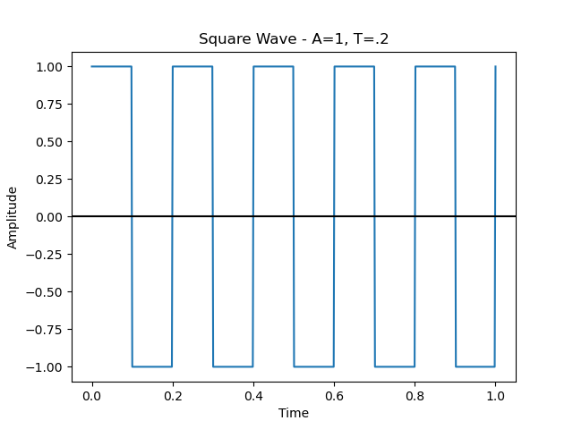
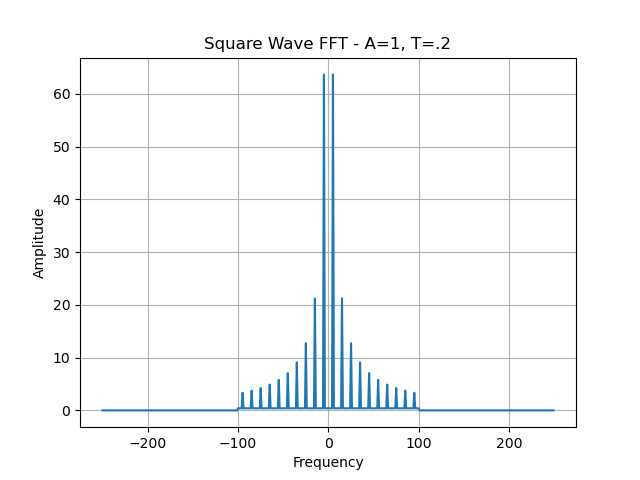
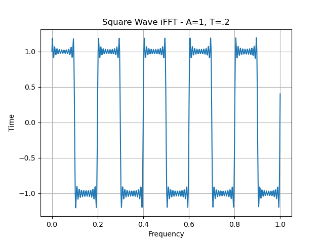
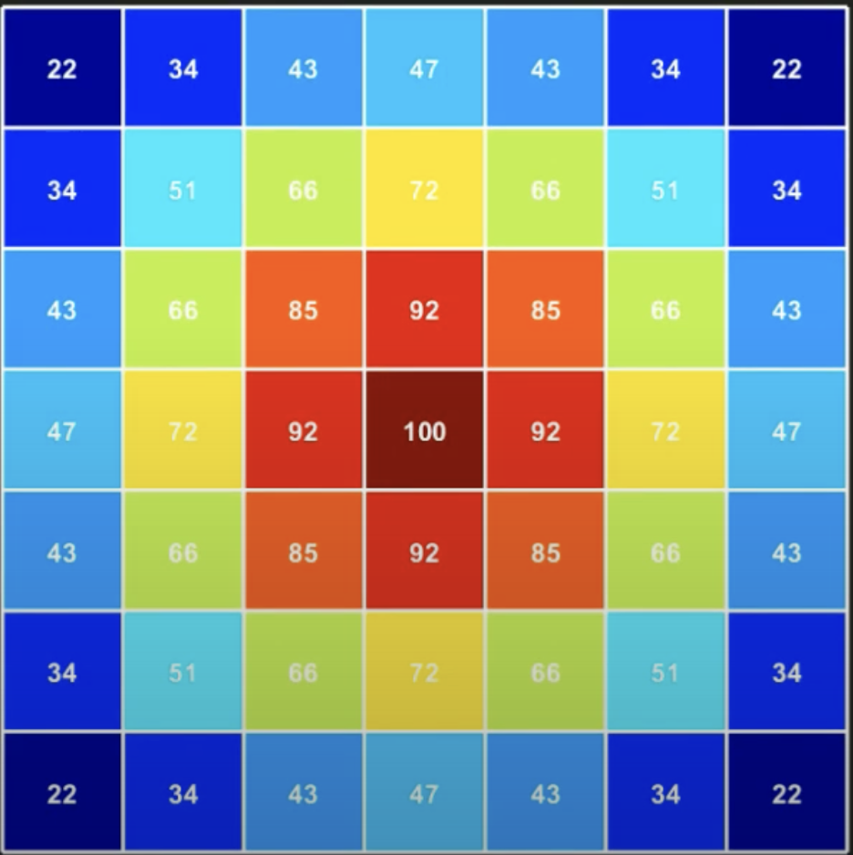
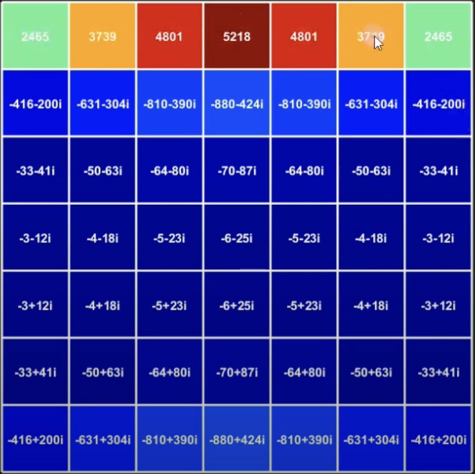
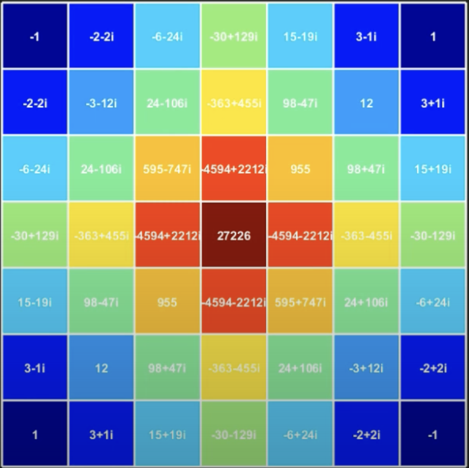

## Fourier Transform

### Basic 1D Fourier Transform

[//]: # (TODO: talk about 1d fourier, periodic decomposition, etc)
The Fourier Transform is a mathematical operation which can decompose
a periodic (repeating) signal into its component frequencies. From these
frequencies, a set of sines and cosines with the same phase, different
frequency, and different amplitudes can be used to reconstruct the original
signal. This can be extended to apply to non-periodic signals which results in
an approximate reconstruction of the periodic parts of the original signal. It
can also be extended to apply to discontinuous signals which results in an
approximate construction of the signal using sinusoids (sines and cosines). The
range of the Fourier Tranform are complex values which describe the amplitude
of sines and cosines with frequencies from -$\infty$ to $\infty$. As an
example, let's take a look at an ideal square wave which is a function with
amplitude A and period T which alternates between A and -A every T/2 seconds.
This signal is comprised of an infinite amount of sinusoids. An example can be
seen below:

We can perform a Fourier Transform on this signal to see the component
frequencies. To move from the ideal version of signal with infinite frequencies
to a more realistic, band-limited representation, we'll cut off any frequencies
greater than 100Hz in order to have a more compact representation. This
practice of cutting off frequencies greater than a limit is known as a low-pass
filter (we only pass frequencies lower than the limit). We can see a plot of
the Fourier Transform below:

We can see that when the frequency is 0, the amplitude is 0. This represents
the average value of the signal. Since the square wave is 1 for T/2 seconds,
and -1 for T/2 seconds, the average value would be 0. We can also see that the
plot is symmetric across the y-axis. The exact reason for this is due to the
[complex exponential definition of sine and
cosine](https://en.wikipedia.org/wiki/Sine_and_cosine#Complex_exponential_function_definitions)
and will not be explained in depth. Let's try reconstructing a signal from this
representation. We can perform the inverse-Fourier Transform to convert
a frequency spectrum to a time-domain signal. This is shown below:

We can see that the filtered signal still represents the original square wave
to some extent. We can now make out some of the individual sinusoids which
represent the signal at the maximums and minimums of the signals. Also, the
rise and fall between 1 and -1 is no longer instantaneous. This is all due to
the fact that we cut out the extremely high frequency components which smoothens
the signal out greatly. Despite this, we still have a quite accurate
representation of our original signal with a much more compacted representation
than the previous ideal version.

---
**NOTE**

Digital signal processing and image processing actually use the discrete time
definition of the Fourier Transform, not the continuous time version described
above. The main difference between the continuous and discrete version is that
the discrete version results in a periodic frequency output due to the nature
of discrete, periodic signals in the time domain. This cyclic property makes it
a more efficient representation of the original signal than the infinite
frequency continuous signal.

---

### A Step Higher

So far, we've done the Fourier Transform for 1-dimensional vectors. However,
images are arranged in two directions: a series of rows and columns of pixels.
If we want to apply it to images, we'll need to perform the Fourier Transform
in two directions. We'll first do it across the columns of the image, then
along the rows.

The images below are from a great [youtube video explaining 2D Fourier
Transform](https://www.youtube.com/watch?v=v743U7gvLq0).

We'll start out with our original image with different pixel values.

We'll do a Fourier Transform down the columns of the image. We can see the
results of each Fourier Transform down each column with the rows at the top
representing the lower frequencies, and the rows at the bottom representing the
higher frequencies.

Then, we'll do a Fourier Transform across the rows of the image. We can see
that the resulting array has a radial pattern with increasing magnitudes
towards the center. The center represents the average value of the entire
image. The 2D equivalent of low frequencies of the image are towards the
center, and the 2D equivalent of high frequencies are towards the edges of the
image.

Now that we have a frequency representation for our image, we can perform
normal 1D signal processing techniques to the image.

---
**NOTE**

The Fourier Transform technically shouldn't be used for image processing
because images have no sense of periodicity, however, it's a simple enough tool
for basic demonstration purposes.

---

## Filters

[//]: # (TODO: talk about low pass, high pass, band pass filters)
As previously mentioned, we can use filters to limit the frequencies which we
care about. When applied to images, these can be used for things such as
rudimentary edge detection or blurring. The image below is our original image:

A high pass filter keeps high frequencies and filters out low frequencies. This
filter results in the output being smoothened out since the low frequency
details are removed. We can apply a high pass filter to blur the original image
to get the following image:

Similarly, a low pass filter keeps low frequencies and filters out all high
frequencies. After applying this filter, edges are more pronounced since they
are represented by high frequencies. We can use a low pass filter to do basic
edge detection:

---
**NOTE**

Don't worry, all the code to implement the Fourier Transform will be given to
you! This topic is very complex and requires a deep understanding of the
mathematical basis behind it, it is okay if you don't fully understand what's
happening (make sure to take ECE30100/ECE43800 if this interests you at all
though!). This explanation is just so you have a conceptual basis to play
around with the image processing code.

---
